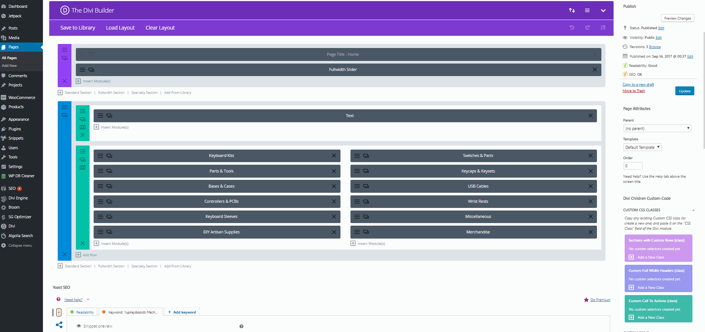

# Hide Elements on certain device types in Divi

The Divi theme framework allows for you to easily design powerful layouts that display different information or in a different manner on desktop/laptop, tablet, and mobile via the **[right click controls](https://www.elegantthemes.com/documentation/divi/right-click/)** inside of the theme framework.

This functionality can allow you to enable/disable certain elements from displaying on pages for users viewing the site on mobile, or display certain information for mobile users only, etc. 

From a page that uses the **Divi Page Builder** you can right click on any element and scroll to **Disable** and select which devices you'd like to disable a content block on.
