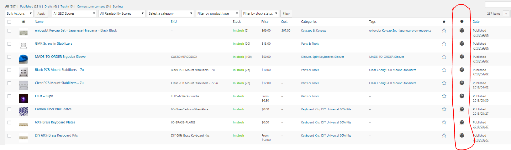

# Adding New Products to WooCommerce

## Types of Products

* Simple Product
* Grouped Product
* External/Affiliate Product
* Variable Product
* Composite Product
* Product Bundles

!!! tip
    You can identify the type of product using the column circled above. If you mouseover each product it will show one of the types of products from the list above.

### Adding a Product

* Login to WordPress Admin
* Navigate to **Products** --> **Add New**

!!! tip
    For products that are **variable, composite, or product bundles** it is generally easiest to use the **Duplicate** function to clone an existing product of the same type. From the duplicated product you can edit the product details, URL, photos, price, etc.

### Adding a Composite Product

* Composite products require tweaking the WordPress/WooCommerce template utilized from default products.

#### Other Resources

* [Managing Products Guide from WooCommerce](https://docs.woocommerce.com/document/managing-products/)

* [Bulk Editing Product Details](https://nicola.blog/2015/04/21/bulk-edit-products/)

* [Bundled Products & Inventory](https://docs.woocommerce.com/document/bundles/bundles-configuration/#inventory)

