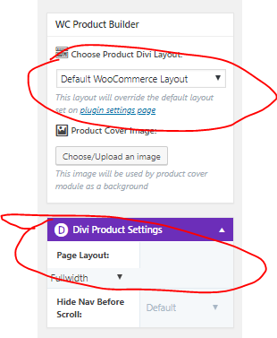

# Adding New Products to WooCommerce

## Types of Products

* Simple Product
* Grouped Product
* External/Affiliate Product
* Variable Product
* Composite Product
* Product Bundles

### Adding a Product

### Adding a Composite Product

* Composite products require tweaking the WordPress/WooCommerce template utilized from default products.

#### Other Resources

* [Managing Products Guide from WooCommerce](https://docs.woocommerce.com/document/managing-products/)

* [Bulk Editing Product Details](https://nicola.blog/2015/04/21/bulk-edit-products/)

* [Bundled Products & Inventory](https://docs.woocommerce.com/document/bundles/bundles-configuration/#inventory)

