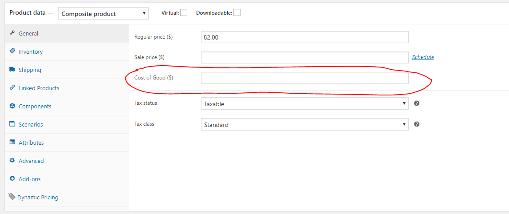
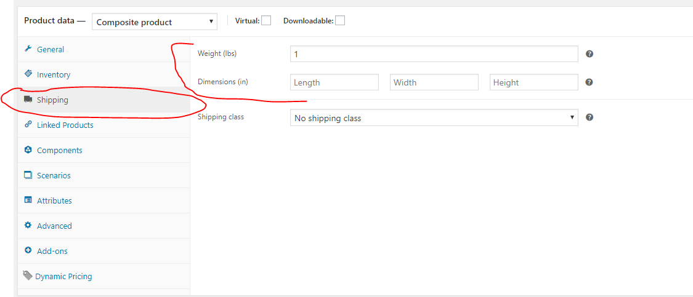
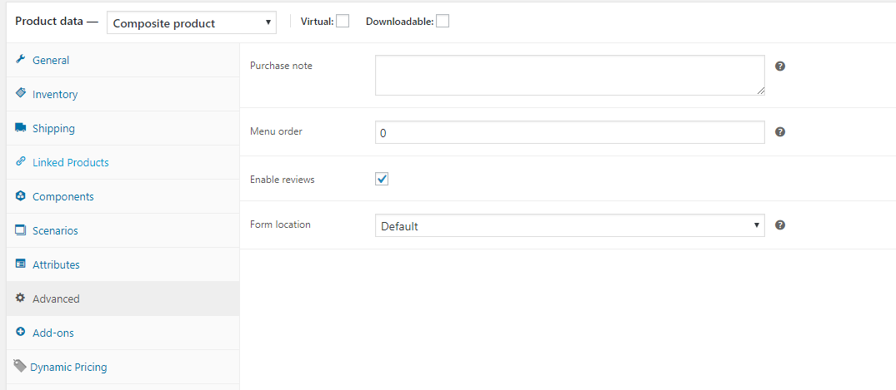
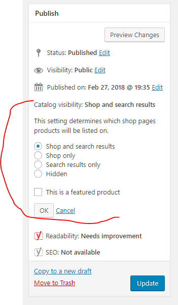

# Managing Product Data in WooCommerce

## Cost of Goods

* Login to **WordPress Admin**
* Navigate to **Products** --> **All Products**
* Select a Product & click **EDIT**
* Scroll to the **PRODUCT DATA** card --> **General Tab**
* Enter the cost of the product in the **COST OF GOODS** box in USD.
* Save the record by clicking on **UPDATE** in the **PUBLISH** panel.

## Weight & Dimensions

* Login to **WordPress Admin**
* Navigate to **Products** --> **All Products**
* Select a Product & click **EDIT**
* Scroll to the **PRODUCT DATA** card select the **SHIPPING** tab.
* Enter the **WEIGHT** *(in lbs)*
* Enter the **PRODUCT DIMENSIONS** *(in inches)*
* Save the record by clicking on **UPDATE** in the **PUBLISH** panel.

## Inventory

!!! note
 	Due to how WooCommerce builds products in comparison to the Magento platform this might be slightly complex initially. Some products are have their inventory managed at the **PRODUCT VARIATION** level *(Example: Crosshatch Standoffs)*, some products inventories are managed via the product level, and some are managed via a product not displayed on the public facing site as the site makes use of Product Bundles, etc. 

 	**I'm still thinking about a way to show this to you to make it easier, however, at this point I think you might figure it out via navigating around various products.** 

* Login to **WordPress Admin**
* Navigate to **Products** --> **All Products**
* Select a Product & click **EDIT**
* View the **Inventory** tab.
* Save the record by clicking on **UPDATE** in the **PUBLISH PANEL** 

!!! tip
	There are inventory reports available inside of WooCommerce that will be helpful for a quick birds eye view of product stock. Visit the [WooCommerce Reporting](https://brianjking.github.io/1upkeyboard-docs/woocommerce/woo-reporting/) docs for more info.

## Reviews

* Login to **WordPress Admin**
* Navigate to **Products** --> **All Products**
* Select a Product & click **EDIT**
* Scroll to the **PRODUCT DATA** card select the **ADVANCED** tab.
* Select **ENABLE REVIEWS** to either enable/disable product reviews of a given product.
* Save the record by clicking on **UPDATE** in the **PUBLISH PANEL**.

## Product Visibility

Hiding products from appearing in the shop search and/or catalog can be achieved by following the instructions below.

* Login to WordPress Admin
* Click on **PRODUCTS** --> **ALL PRODUCTS** 
* Locate the product you wish to edit
* Click **EDIT PRODUCT**
* In the right hand column locate the **PUBLISH** box which has an option of **CATALOG VISIBILITY** and select **EDIT**.
	* Available options for **PRODUCT VISIBILITY**  
		* Shop and search results
		* Shop only
		* Search results only
		* Hidden 

