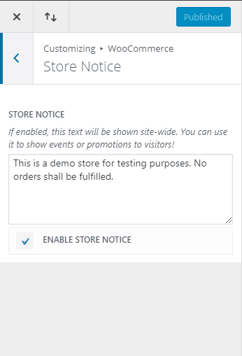

# Misc WooCommerce Details

## Products Displayed Per Page 

* Up to **40** products can be displayed on a product category page prior to pagination.
	* This is set in the Divi settings.

## Store Notice Message

WooCommerce can display a notice that appears on the bottom of all pages until hidden. This is a useful feature for displaying important messaging to visitors regardless of the page they're viewing.

* Login to WordPress Admin
* From the WordPress Admin menu navigate to **APPEARANCE** --> **CUSTOMIZE**
* Select **WooCommerce** --> **Store Notice**
	* Add the text you'd like displayed in the store notice.
	* If you'd like to disable the store notice remove the checkmark from the **ENABLE STORE NOTICE** box. _(see screenshot below)_
* Click **PUBLISH** 
* After updating the store notice it's best to [Flush the Siteground Cache](https://brianjking.github.io/1upkeyboard-docs/wordpress-basics/flush-cache/)

