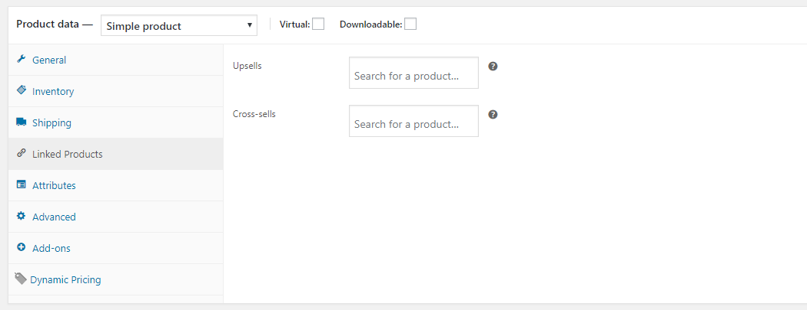
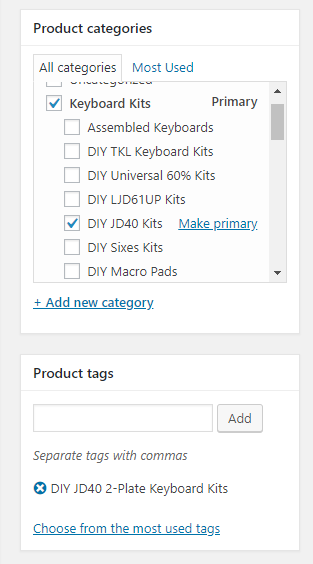
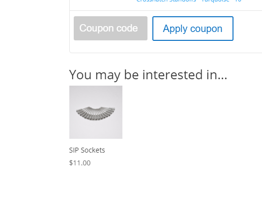

# Upsells & Cross-sells in WooCommerce

WooCommerce includes the configuration of Upsells & Cross-sells inside of each product regardless of product type. Products can be related to each other in three ways: **Up-Sells, Cross-Sells or by having the same tags or categories**.

## Adding an Upsell or Cross-Sell to a Product

1. Go to **WooCommerce** > **Products** and select the product on which you’d like to show an up-sell or cross-sell.
2. Scroll down to the Product Data panel. _(see screenshot above)_
3. Select the Linked Products tab in the left menu.
4. Add the product you wish to link to by searching for it.
5. Click Update to save the product.

### Upsells

* Upsells are displayed on the **PRODUCT PAGE** for the currently displayed product. 

### Cross-sells

Cross-sells are products that you promote in the cart, based on the current product.

* Cross-sells are displayed on the **CART** page prior to a customer checking out.

#### Other Resources

* [WooCommerce Upsells & Cross-sells documentation](https://docs.woocommerce.com/document/related-products-up-sells-and-cross-sells/)
