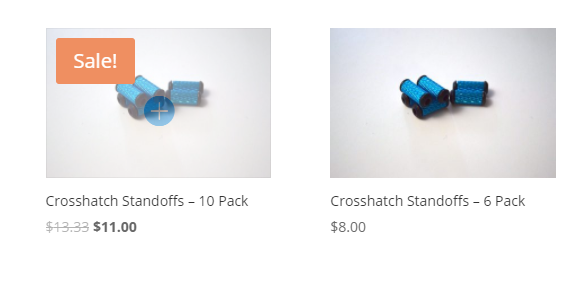
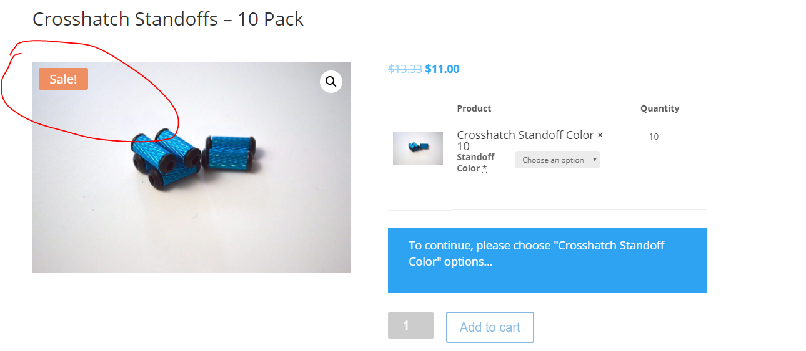

# Advanced WooCommerce 


## Hiding On Sale Badge For Specific Products





!!! note
 	Hiding a **SALE** badge from displaying on a product is handled via custom `CSS` on a product by product basis. Below is an example of the CSS for the *Crosshatch Standoffs - 10 Pack* product.

```css
.post-207513 .onsale {
	display: none !important;
}
```

* Visit the product you want to remove the **SALE** badge from while logged in as a WordPress Administrator.
* Edit the product.
* Obtain the **POST ID** from the URL 
	* Example: `/wp-admin/post.php?post=207513&action=edit`
	* `post=207513` is the important portion of this that is used in the CSS override above.
* Add the `CSS` to WordPress.
* Flush the siteground cacher.
* View the shop/product page to confirm this works.
