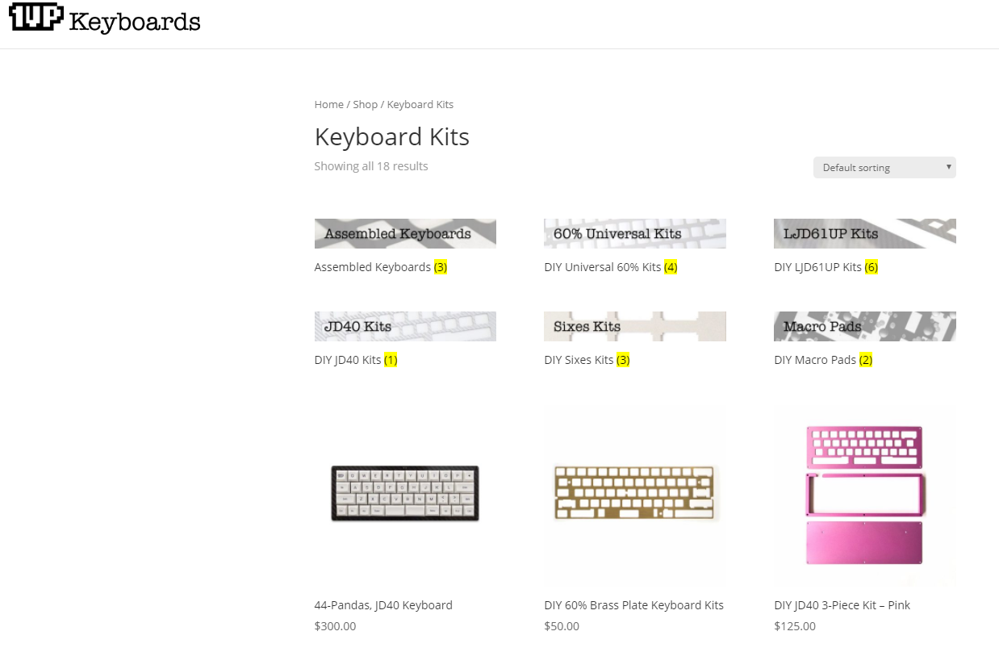

# WooCommerce Categories 

* Login to **WordPress Admin**
* Navigate to **Products** --> **Categories**

## Subcategory Image Slices

If you would like to add image slices for navigating to a sub-category of a product visit the **Categories** area _(as per the instructions above)_.

* Edit the **Parent Category** you'd like to have image slices displayed for. 
	* _Example:_ Keyboard Kits
* Select **BOTH** in the **DISPLAY TYPE** dropdown. *(This will display both child categories of the parent and products in the parent/child categories below).*

* Save the record.
* Edit each of the **CHILD CATEGORIES** *(Example: TKL Kits, LJD61UP Kits, etc)*
* Upload the image slice to each of these that corresponds with each of the categories.
* Save each record.

