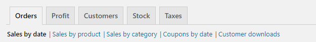
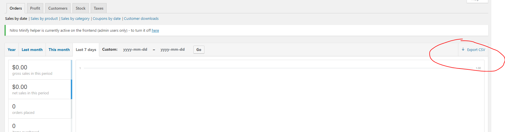

# WooCommerce Reporting

## Types of Reports

* Orders
	* Sales by date
	* Sales by Product
	* Sales by category
	* Coupons by date
* Profit
	* Profit by date
	* Profit by product
	* Profit by category
* Customers
	* Customers vs. Guests
	* Customer list
* Stock
	* Low in stock items
	* Out of stock items
	* Most stocked items
	* Insufficient Stock 
	* Product Valuation
	* Total Valuation 
* Taxes
	* Taxes by code
	* Taxes by date

### Accessing WooCommerce Reporting

* Login to **WordPress Admin**
* Navigate to **WooCommerce** --> **Reports**
* Select the reporting type from the horizontal menu.

* Many report types can be exported as a **CSV** for :fa-download: for analyzing in Microsoft Excel, Google Sheets, etc. by clicking on the **EXPORT CSV** link.

