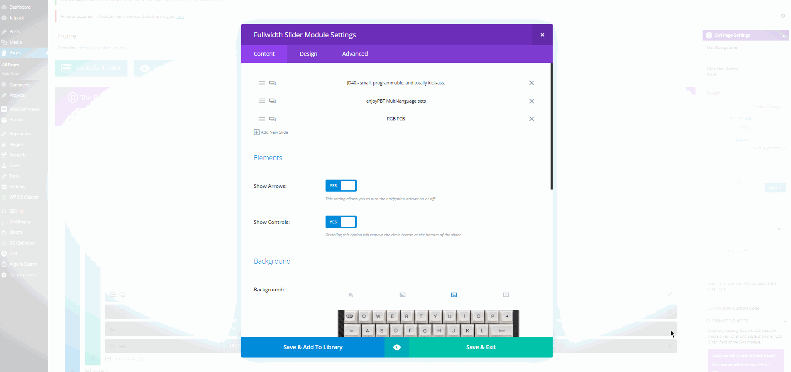

# Managing Homepage Slider 

## Editing Homepage Fullwidth Slider Items

* Login to **WordPress Admin**
* Navigate to **Pages** --> ** **All Pages**
* Click **Edit** on the page labeled **Home**
* Follow instructions seen in recording below.

## Adding New Slides to Homepage Fullwidth Slider

