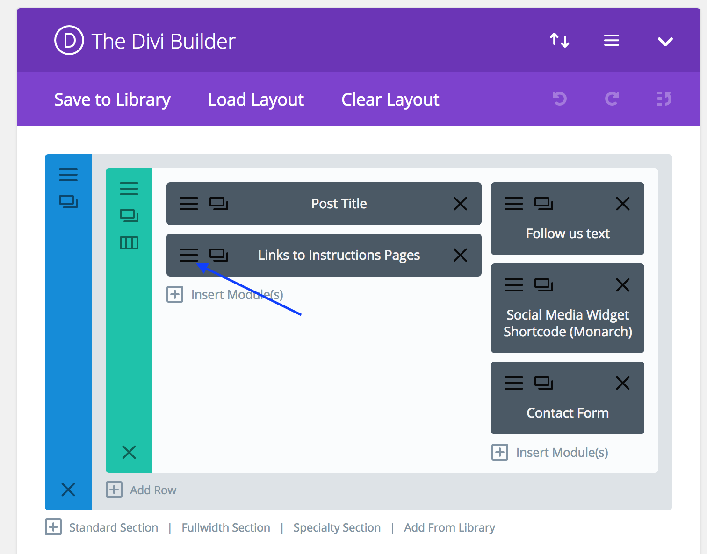
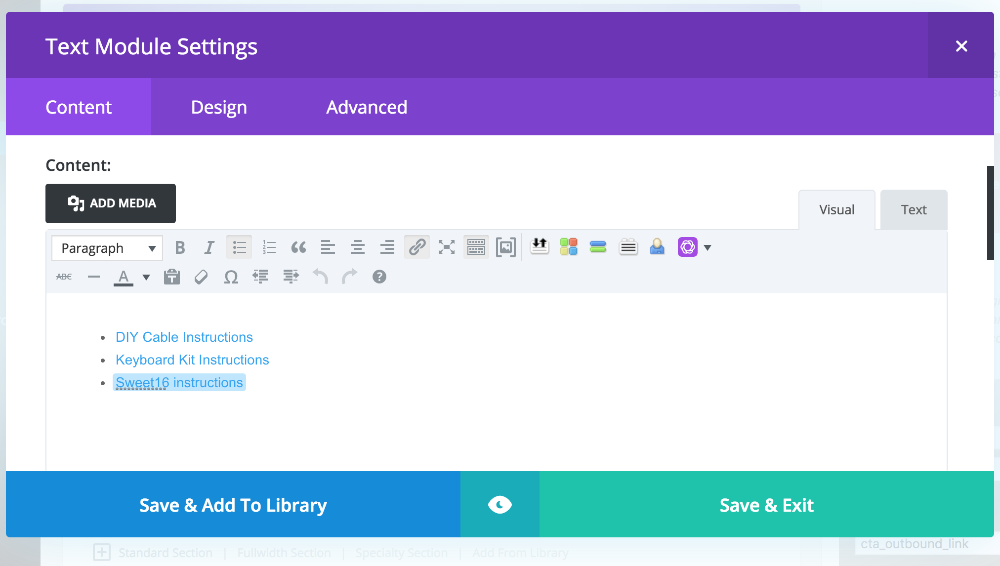

# Managing Pages in WordPress 

## Accessing WordPress Pages in the WordPress Admin

* Login to **WordPress Admin**
* Click on **Pages** --> **All Pages**

## Normal WordPress Pages

### Instructions & Downloads Pages

* Login to **WordPress Admin**
* Click on **Pages** --> **All Pages**
* Select the **Instructions & Downloads Page**

* Add or update links using the Divi Editor as seen below.

## WooCommerce Managed Pages

!!! note
 	**WooCommerce** has specific pages that are managed via separate templates that _**cannot/should not**_ be modified via the **WordPress Pages** section of your WordPress Admin. 

* Pages managed by **WooCommerce Templates**
	* My Account
	* Checkout
	* Cart 
