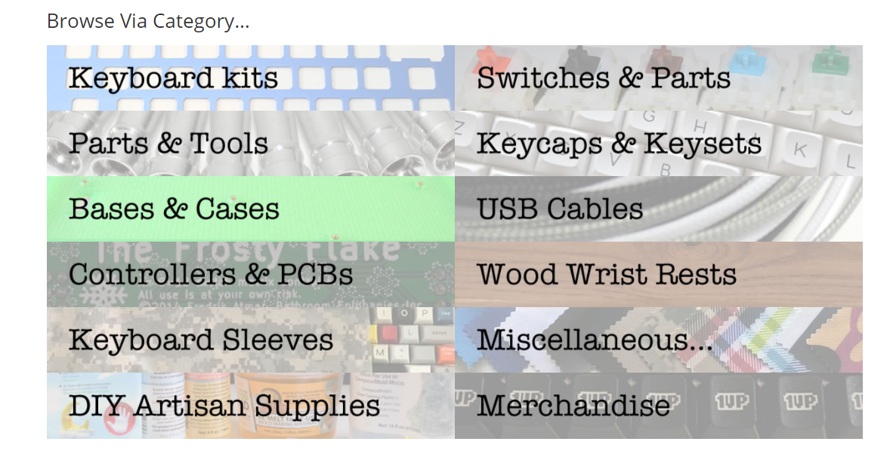
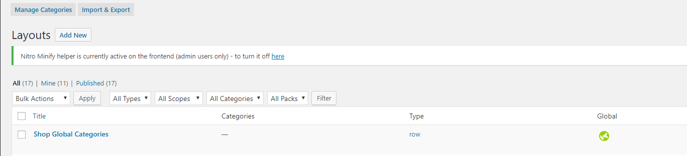
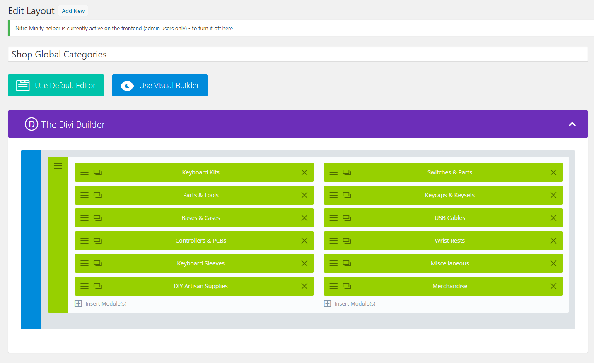
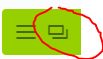
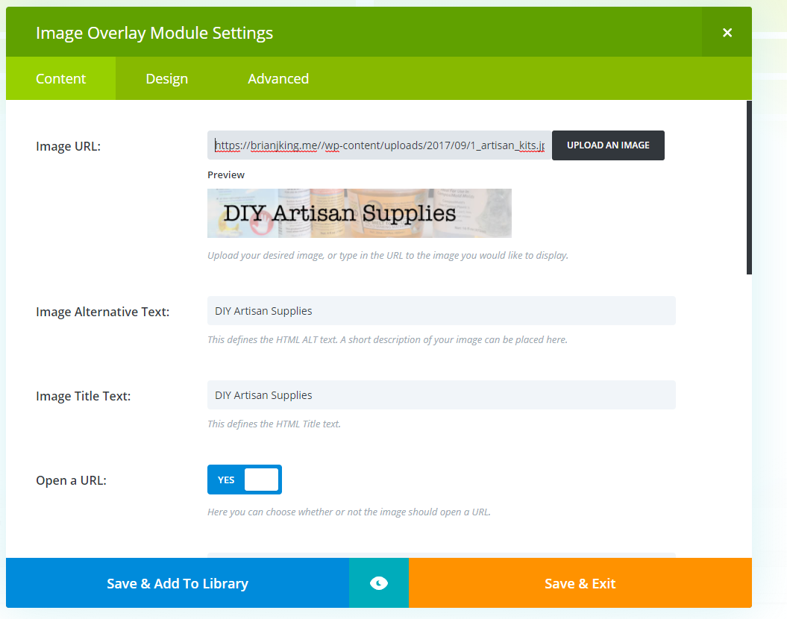

# Updating the Homepage & Shop Page Category Menu

* Login to the **WordPress Admin**
* From the horizontal menu click on **Divi** --> **Divi Library**
* Select **Shop Global Categories** from the list of **Divi Library Items** --> **Select Edit** 

* This will load the **Global Divi Library** which is characterized by the **LIME GREEN** seen in the below image.
	* *Any edits to **GLOBAL** items will be visible anywhere the global layout is utilized. In the case of the **SHOP GLOBAL CATEGORIES** that is currently the **HOMEPAGE** & **SHOP PAGE** *

## Adding New Categories to the Shop Global Categories Menu

* Click the **Clone** icon to clone one of the categories *(Example: DIY Artisan Supplies)*

* Click the :fa-bars: icon to edit the newly cloned item.

* Select the original image (black text) for the **Image URL** section, enter relevant Alternative Text & Title Text
* Select the mouseover image (white text) for the **Overlay Image URL** section
* Enter the **Link URL** using a *relative URL (example: /product-category/artisan-kits)* into the **LINK URL** box
* Click **Save && Exit**
* When you are finished making the edits to the **Shop & Homepage Global Categories Menus** click **Update** under the **Publish** menu in the left hand side of the page.
* Flush Siteground Cache
* Confirm your updates look the way you want them to by visiting the **HOME** & **SHOP** pages.

